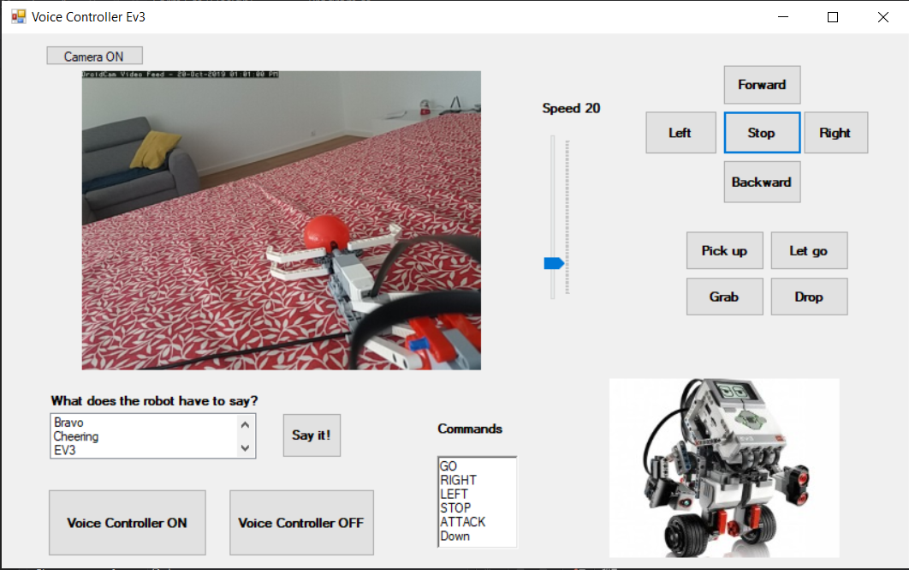

# EV3CameraApp

Youtube: https://youtu.be/JMsEb3dLxBw

## Table of contents
* [General info](#general-info)
* [Screenshots](#screenshots)
* [Technologies](#technologies)
* [Code Examples](#code-examples)
* [Features](#features)
* [Status](#status)
* [Contact](#contact)

## General info
Control the robot and use your phone to watch video :)
My application allows you to control the robot and allows you to view video from your phone.

## Screenshots

## Technologies
- Windows Forms App C#

## Features
- Video from the phone's camera.
- Control by buttons.
- Voice control: https://youtu.be/uST-xErL2LQ

## Status
Project is: _in progress_

## Contact
Created by lukasz.neumann90@gmail.com - feel free to contact me!
